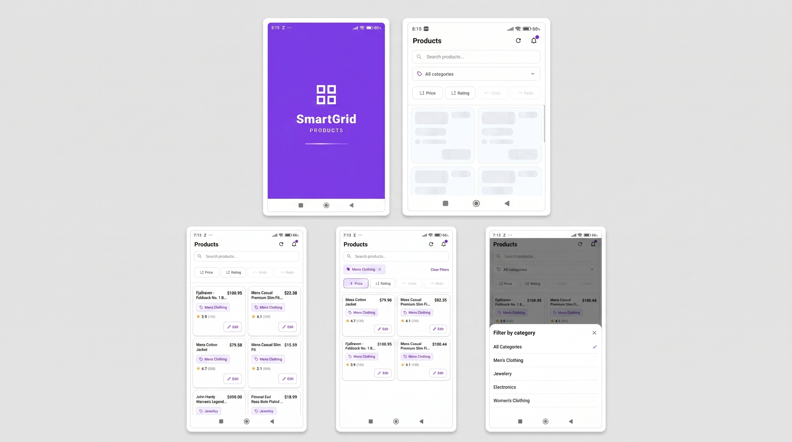

# SmartGridProductMobile

SmartGridProductMobile is a React Native app for iOS and Android that showcases a polished product grid with search, filtering, sorting, optimistic category edits, undo/redo history, and simulated live updates.

## App Snapshots



## Highlights

- 2-column product grid with image, title, price, category, and rating
- Search products by title with debounced input
- Filter and sort with native mobile controls
- Edit categories with optimistic updates
- Undo and redo category changes
- Simulated live updates for price and rating
- Skeleton loading state and toast notifications
- iOS-style spacing and touch-friendly controls

## Splash Screen

The app includes a custom animated splash screen with the SmartGrid logo, smooth fade/scale motion, and a linear gradient loading bar before navigating into the main product view.

## Shimmer Loaders

Product loading uses reusable linear-gradient shimmer placeholders so the UI feels responsive while data is being fetched. The loaders animate across the card layout to represent the product name, price, category, rating, and action areas.

## Tech Stack

- React Native 0.85.2
- React 19
- TypeScript
- Zustand
- React Navigation
- React Native Paper
- React Native Toast Message
- React Native Vector Icons

## Project Structure

```text
src/
├── App.tsx
├── types.ts
├── components/
├── features/
├── hooks/
└── screens/
```

## Getting Started

### Install dependencies

```bash
npm install
```

### Install iOS pods

```bash
cd ios
pod install
cd ..
```

### Start Metro

```bash
npm start
```

### Run on Android

```bash
npm run android
```

### Run on iOS

```bash
npm run ios
```

### Run tests

```bash
npm test
```

## Available Scripts

- `npm run android` - Build and run the Android app
- `npm run ios` - Build and run the iOS app
- `npm run start` - Start Metro bundler
- `npm run lint` - Run ESLint
- `npm test` - Run the Jest test suite

## Notes for GitHub and Codespaces

- This project is ready to publish on GitHub as a standalone React Native app.
- Mobile builds are not meant to run inside GitHub Codespaces; use a local Android emulator, iOS Simulator, or physical device.
- Open the repo locally, install dependencies, then run Metro and your target platform.

## External Dependencies

- `@react-navigation/native`
- `@react-navigation/native-stack`
- `react-native-paper`
- `react-native-toast-message`
- `react-native-vector-icons`
- `zustand`
- `axios`

## Development Notes

- Product data is loaded from the Fake Store API.
- Live updates are simulated in the app so price and rating can change over time.
- Category edits are optimistic and can be undone from the UI.

## Publishing Checklist

- Add a license file before making the repository public.
- Make sure native dependencies are installed on first run.
- Verify Android and iOS builds on a clean machine before publishing.
- Test search debounce (verify filter delays 300ms)
- Test category filter modal
- Test live updates (verify price/rating change every 5–10s)
- Test icon rendering (verify icons display correctly)

## Future Enhancements

- Request cancellation (AbortController)
- AsyncStorage for persistence
- Pull-to-refresh
- Product detail screen
- Batch editing
- Analytics (Sentry)
- Deep linking
- Search history
- Favorites/bookmarking
- Image caching
- Dark mode toggle
- Offline support